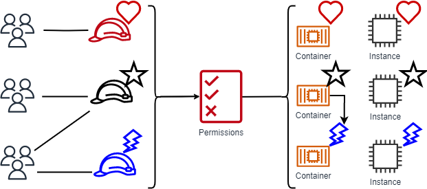

# Attribute-based access control (ABAC)

Attribute-based access control (ABAC) is an authorization strategy that defines permissions based on attributes. 

AWS calls these attributes tags. You can attach tags to IAM resources, including IAM entities (IAM users or IAM roles) and to AWS resources. You can create a single ABAC policy or small set of policies for your IAM principals. 

You can design ABAC policies can that allow operations when the principal's tag matches the resource tag. ABAC's attribute system that provides both high user context and granular access control. 

Because ABAC is attribute-based, it can perform dynamic authorization for data or applications that grants or revokes access in real time. ABAC is helpful in environments that are scaling and in situations where identity or resource policy management has become complex.

